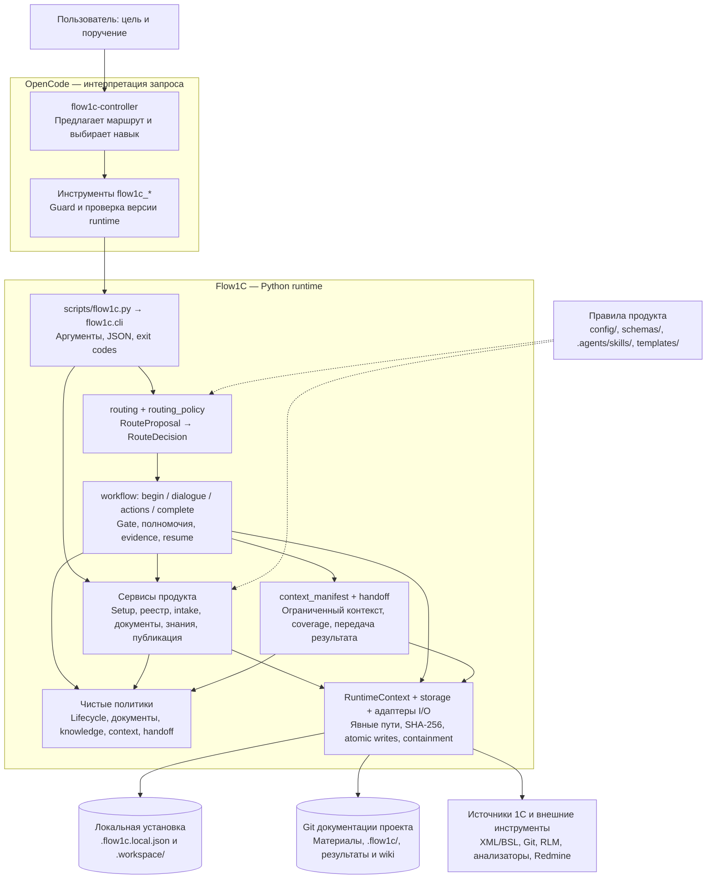
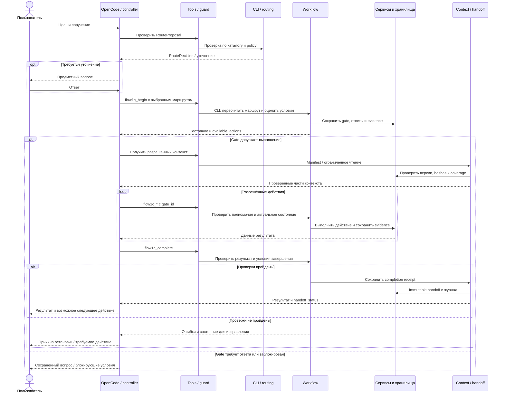
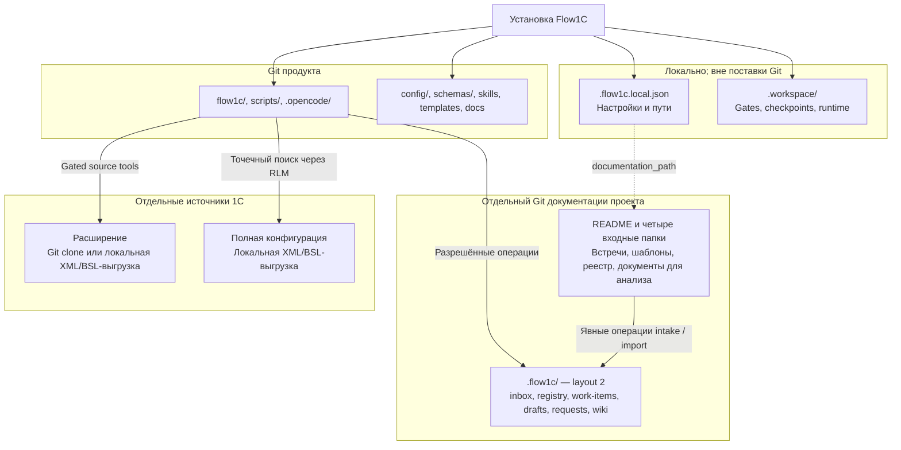

# Схемы архитектуры Flow1C

Схемы описывают текущую реализацию публичного пилота с основной средой
Windows/OpenCode. Подробные контракты и состав модулей — в
[описании архитектуры](architecture.md). Диаграммы записаны в Mermaid и
отображаются непосредственно на GitHub.

## 1. Компоненты и границы ответственности

Стрелки показывают вызовы и обращение к данным, а не полный граф импортов.
OpenCode вызывает Python CLI через адаптер инструментов; внутри Python
сервисы обмениваются данными через функции и `OperationResult`.

- **Модель интерпретирует намерение.** Маршрутизация детерминированно проверяет
  структурированное предложение. Решение о маршруте не предоставляет прав:
  workflow повторно проверяет условия, approvals, evidence и разрешённые действия.
- **Guard — граница OpenCode.** Он проверяет инструменты и активное состояние;
  Python сохраняет собственные проверки. Адаптер вызывает CLI как внешний
  процесс, но сервисы Python не вызывают CLI и не разбирают его stdout.
- **Политики отделены от I/O.** Пути и конфигурация передаются явно. Импорт
  пакета не читает пользовательские файлы и не запускает процессы;
  необязательные интеграции загружаются при использовании.
- **Хранилища выполняют разные задачи.** Локальная установка хранит runtime,
  документация проекта — пользовательские материалы и результаты, источники
  1С — код и выгрузки. Схема не разрешает произвольную запись в эти области.

### Где реализованы компоненты

| Компонент | Основные владельцы |
|---|---|
| Контроллер и инструменты OpenCode | [controller](../.opencode/agents/flow1c-controller.md), [tools](../.opencode/tools/flow1c.ts), [guard](../.opencode/plugins/flow1c-guard.js), [runtime](../.opencode/lib/runtime.mjs) |
| CLI и результаты | [launcher](../scripts/flow1c.py), [cli](../flow1c/cli.py), [results](../flow1c/results.py) |
| Маршрутизация | [routing](../flow1c/routing.py), [routing_policy](../flow1c/routing_policy.py), [каталог](../config/intent-routes.json), [этапы](../config/stages.json) |
| Жизненный цикл и полномочия | [begin](../flow1c/workflow/begin.py), [dialogue](../flow1c/workflow/dialogue.py), [state](../flow1c/workflow/state.py), [actions](../flow1c/workflow/actions.py), [complete](../flow1c/workflow/complete.py), [policy](../scripts/flow1c_policy.py) |
| Предметные сервисы | [setup](../flow1c/setup.py), [readiness](../flow1c/readiness.py), [registry](../flow1c/registry.py), [intake](../flow1c/intake.py), [documents](../flow1c/documents.py), [templates](../flow1c/templates.py), [publication](../flow1c/publication.py) |
| Навигация и знания | [navigation](../flow1c/navigation.py), [knowledge](../flow1c/knowledge.py), [knowledge_policy](../flow1c/knowledge_policy.py), [knowledge_actions](../flow1c/workflow/knowledge_actions.py) |
| Контекст и передача результата | [context_manifest](../flow1c/context_manifest.py), [context_policy](../flow1c/context_policy.py), [handoff](../flow1c/handoff.py), [handoff_policy](../flow1c/handoff_policy.py) |
| Пути, хранение и внешние границы | [context](../flow1c/context.py), [storage](../flow1c/storage.py), [documentation](../flow1c/documentation.py), [git_runtime](../flow1c/git_runtime.py), [sources](../flow1c/sources.py), [redmine](../flow1c/redmine.py) |

## 2. Путь запроса и завершение

Показан запрос, который после маршрутизации проходит через gate. Уточнение
в чате возможно до его создания. Разрешённые инструменты, контекст и условия
завершения зависят от операции, роли и режима `explore` / `draft` / `formal`.

Completion receipt сохраняется до дописывания evidence и передачи. После
прерывания повторный вызов восстанавливает ту же передачу под OS writer lock;
завершённые действия не выполняются повторно. Handoff и coverage не создают
новые approvals. Следующий этап проходит текущий gate по новому поручению.
Подробнее: [маршруты](route-contract.md), [диалог](dialogue.md),
[контекст](context.md), [handoff](handoff.md).

## 3. Границы репозиториев и данных

В схеме показан новый layout 2. Для существующих проектов resolver сохраняет
legacy paths; автоматического переноса нет. Полная конфигурация, credentials,
пользовательские документы и runtime не входят в поставку продукта. Помещение
файла во входную папку само по себе не запускает обработку. Коммиты и PR
документации/расширения выполняются разрешёнными операциями по поручению
пользователя; PR согласуют люди.

[Структура документации](documentation-layout.md) ·
[Входные материалы](project-materials.md) ·
[Знания проекта](project-knowledge.md) ·
[Установка](setup.md)
